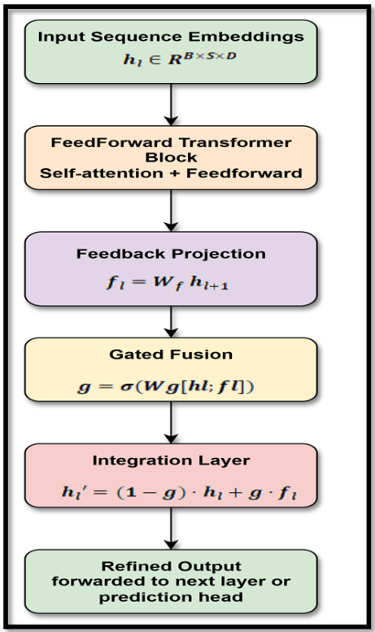
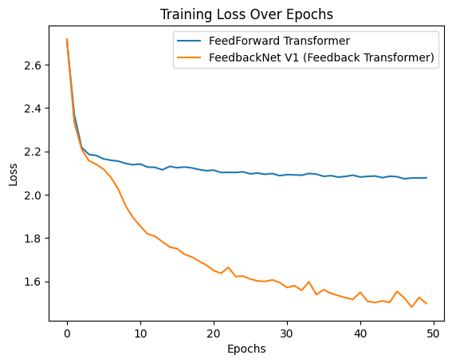
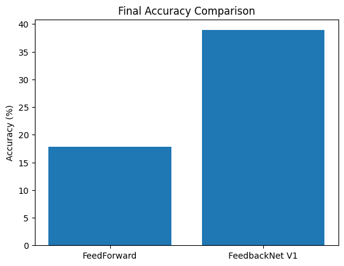

# FeedbackNet V1: Enhancing Transformers with Feedback Loops

FeedbackNet V1 is a research project that explores how adding feedback loops to Transformer architectures can improve reasoning tasks. This version focuses on using synthetic arithmetic datasets to test how feedback integration helps refine representations and improve performance.

---
## Overview

Transformers are widely used in machine learning, but they often struggle with tasks that require iterative reasoning. FeedbackNet V1 introduces a simple feedback mechanism that allows the model to use information from higher layers to improve the output of lower layers. This leads to better learning and performance, especially in reasoning tasks.

Colab-Link: https://colab.research.google.com/drive/1tTYPAIQdd-JD_OC4oMx21mapwyZG-gKg?usp=sharing

---
## Features

- Feedback-enhanced Transformer architecture
- Simple feedback loop with gated fusion
- Synthetic dataset for arithmetic reasoning tasks
- Comparison with standard Transformer architecture
- Provides a baseline for future versions (V2)

---
## Results

FeedbackNet V1 shows noticeable improvement in performance compared to a standard FeedForward Transformer on synthetic tasks. The results suggest that feedback can be a useful addition to Transformer models.

### Training Loss Over Epochs: [FeedForward vs. FeedbackNet V1]

### Final Accuracy Comparison: [FeedForward vs. FeedbackNet V1]

---
MIT License

Copyright (c) 2025 Piyush Bafna 